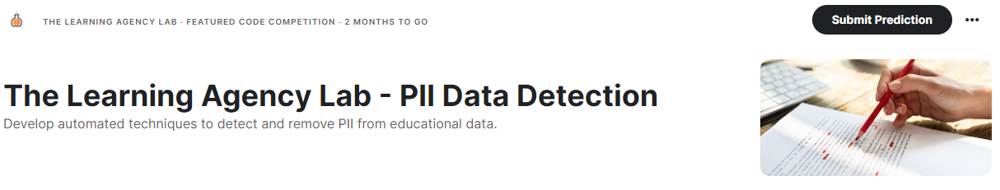

# Kaggle The Learning Agency Lab - PII Data Detection
Develop automated techniques to detect and remove PII from educational data.


# Installation
```
# Using pip:
pip install pre-commit


# install pre-commit for the project
pre-commit install

# run all files
pre-commit run --all-files

# run committed files
git commit
```

# Training

```
python training.py \
  parameters.root_data_dir="./data" \
  parameters.n_fold=4 \
  parameters.save_model_dir="./deberta-v3-base-512" \
  parameters.tmp_dir="./tmp" \
  parameters.preprocess_text=False \
  parameters.debug=False \
  parameters.train_stage_1.wandb=True \
  parameters.train_stage_1.model_path="microsoft/deberta-v3-base" \
  parameters.train_stage_1.output_dir="./deberta-v3-base-512" \
  parameters.train_stage_1.fp16=True \
  parameters.train_stage_1.freeze_embeddings=False \
  parameters.train_stage_1.freeze_n_layers=6 \
  parameters.train_stage_1.seed=42 \
  parameters.train_stage_1.learning_rate=1e-5 \
  parameters.train_stage_1.num_train_epochs=1 \
  parameters.train_stage_1.per_device_train_batch_size=2 \
  parameters.train_stage_1.per_device_eval_batch_size=4 \
  parameters.train_stage_1.report_to="wandb" \
  parameters.train_stage_1.evaluation_strategy="epoch" \
  parameters.train_stage_1.save_strategy="epoch" \
  parameters.train_stage_1.save_total_limit=1 \
  parameters.train_stage_1.overwrite_output_dir=True \
  parameters.train_stage_1.load_best_model_at_end=True \
  parameters.train_stage_1.lr_scheduler_type='cosine' \
  parameters.train_stage_1.metric_for_best_model="f1" \
  parameters.train_stage_1.greater_is_better=True \
  parameters.train_stage_1.weight_decay=0.01
```